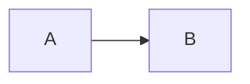
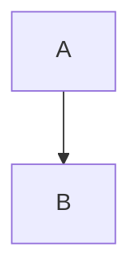
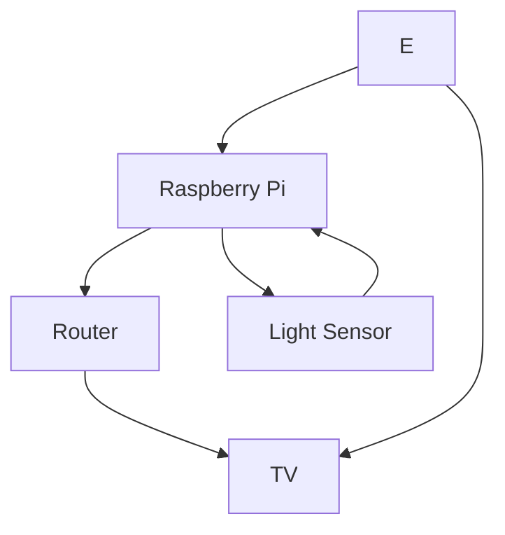

# egl315
## Name
Malcolm M
*Malcolm M*

**Malcolm**

***Malcolm***

## School 
There are 2 options to insert codes (monospace )

### Code block
```
I am at at NYP
Blk S 
```

### Code Line
`sudo rasp pi config`

## Adding picture 
This is a fantastic pic of myself


need to manually resize before adding pic

## Block Diagram 

Top Down


Left to Right 



